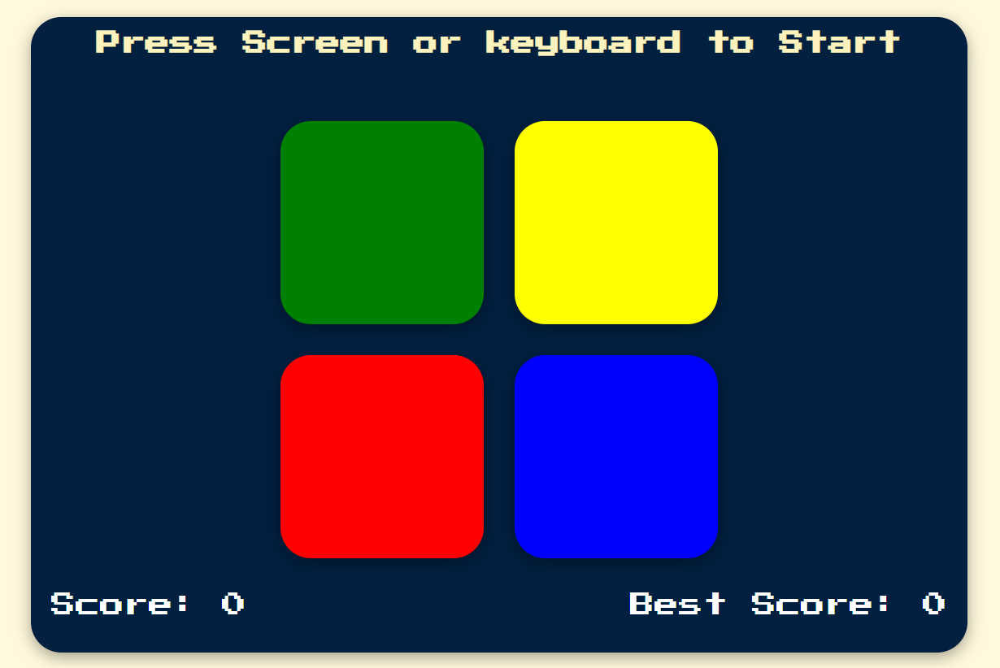

# Simon Game 🧐

A game project called Simon Game made using JavaScript, React, and CSS. The game follows the classic Simon Game rules where users need to memorize and replicate the sequence of colors displayed. The game gets progressively more challenging as the sequence grows longer. The score increases with each level, and players can track their best score.

 

## Developer

|  |
| :----------------------------------------------------------------------------------------: |
|              Sung U Jung [@SungJung0616](https://github.com/SungJung0616)              |

 

## Deployment Address

[Simon Game](https://sj-simongame.netlify.app/)

## Stacks

### Environment

 

### Config

### Development

   

### Deployment

 

## Features

### JavaScript Utilization

- Generates and stores a sequence of colors for the user to memorize and replicate.
- Validates user input against the sequence and determines the game outcome.
- Updates and maintains the current score and best score.

### React Utilization

- Components are designed and organized for reusability and manageability.
- State management using useState Hook to track the game state, user input, and scores.
- useEffect Hook to handle game initialization and state updates.
- Props to pass state values for rendering components.

### CSS Utilization

- The design and responsive work are done using CSS for a visually appealing interface.
- Animations to highlight the active color during the game sequence.
